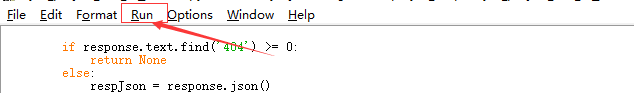

### 脚本说明


#### 1、原料：

##### （1）该脚本基于python3.7环境开发，所以实现安装好python3.7环境

##### （2）需要安装第三方模块 MySQLdb、requests、pika


#### 2、脚本目录结构

##### (1)目录结构

​	用于运行的只有两个文件，

​	- sync_project_info_to_yundao.py

​	- config.ini 

且放在同一个目录下.


##### （2）配置文件config.ini

```ini
[SYNC_APPS]
inclusive=[1361, 1359, 1352, 1348]
exclusive=[1234]

[YUNDAO]
yundao_url=http://xx.xx.xx.xx:30088
login_url=/login/loginSso
username=
password=

[MYSQL]
host=
port=
username=
password=
db=

[MQ]
host=
port=
username=
password=
vhost=

[GITLAB]
url=
private_token=
default_group=
default_user=
```


以下是配置文件中部分变量的说明：

[^注]: config.ini中的所有变量都是必填的

```
[SYNC_APPS]
inclusive  列表，设置要同步的appId列表, 当为空， 即[]时，表示同步所有项目
exclusive 列表， 用于设置不需要同步的appId

[YUNDAO]
yundao_url  云道url， 一般如http://xx.xx.xx.xx:port
login_url=/login/loginSso  云道登录URL， 默认是/login/loginSso， 不需要修改

[GITLAB]  # 这是目标gitlab相关的配置信息
url   # gitlab的访问地址， 可通过 云道数据库 sys_config表中查询到
private_token  # gitlab私钥，可通过 云道数据库 sys_config表中查询到
default_group  # 默认群组，可通过 云道数据库 sys_config表中查询到
default_user  # 默认用户， gitlab私钥对应的用户名

```


#### 3、执行

使用idle打开该文件，点击下拉框中的run module即可执行




#### 4、执行结果

##### （1）执行过程中，界面上会输出相应的打印信息，如下图所示：


##### （2）注意

- 执行开始时，需要用户确认，要同步的项目是否正确， 如下：


- 执行过程中，如果抛出异常，则需要用户确认，是否继续向后执行， 如下：


